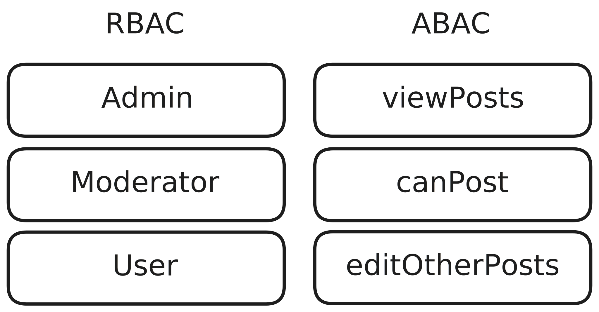

Authorization can be approached through two main methodologies:

- Role-Based Access Control (RBAC)
- Attribute-Based Access Control (ABAC).

RBAC is centered around the roles assigned to users, essentially focusing on who you are. In contrast, ABAC is more dynamic, concentrating on what actions you can perform based on attributes. Here is a simple example of how two systems could be modeled using the two different methodologies:

From my experience, RBAC can be limiting when dealing with dynamic permissions. For those seeking fine-grained control, ABAC is often the better choice. A notable library that supports both RBAC and ABAC is [@casl/ability](https://casl.js.org/v6/en). However, implementing hierarchical permissions with this library can introduce complexity. While creating a custom solution might seem appealing, it demands careful planning to avoid errors. Ironically, as the complexity of a casl-based solution increases, it often requires a significant amount of custom code anyway. Even solutions like [cerbos](https://cerbos.dev) while good in theory with its extracted policy model, in my opinion requires a lot of work from the developers end to morph the data into the correct format.

ABAC introduces the concept of a policy, a policy usually consists of 3 things:

- **Subject** - The actual thing you want to check against. In discord this could be a chat, server, voice-channel, etc. Anything you might want to do something with, or access.
- **Action** - The action represents what you want to do with the subject. This could be CRUD operations (read, write, delete) or but could just as well be eg "invite members", "kick" or "ban".
- **Resource** - If the subject is the type of the thing you're trying to access, the resource is the specific instance of the subject. The resource carries an id pointing to the specific instance in the database.

### Learnings

- RBAC

  - ✅ Quick to understand
  - ✅ Easier to set up
  - ❌ Does not scale well. As more functionality is added, roles will grow and become more complex. Fixing the problem by adding more roles will work as long as the characteristics of the new features are still within the scope of the existing roles.

- ABAC: There are some solutions available for ABAC, such as [@casl/ability](https://casl.js.org/v6/en) and [cerbos](https://cerbos.dev).

  - ✅ More flexible than RBAC
  - ✅ More scalable than RBAC
  - ❌ More complex to set up
  - ❌ Can differ significantly in implementation, making it hard to follow a standard pattern and switch between solutions.

- Authorization becomes more complex when multi-tenancy is introduced. This is because, up until now, access rights could be attached to a user. However, with multi-tenancy, what you can access varies depending on context. For example, on Discord, you might be an admin in one server but not in another. Therefore, you cannot just have a "role" field anymore.

- CASL is not great with hierarchical access. While it is possible to implement it, it requires significant effort and a lot of self-implementation.

### Considerations

In addition to what has previously been mentioned, there are some considerations to keep in mind when implementing authorization in a multitenancy context. Here are some questions that are good to ask yourself:

1. How should hierarchical access be handled? If you utilize ABAC and you have a resource "chat" in a server in Discord, with ABAC you might give a user access to a specific chat or all chats in the server. Now if you give full access to all chats, and already have a rule that is specific to one chat, should that rule be overriden, deleted or should it be merged?

2. How can authorization be built in such a way that it is "easy to do right"? How can the authorization logic be implemented so that it is not forgotten while writing business logic?

3. Rule migrations: When rules change or are deleted, how should old rules react to it?
